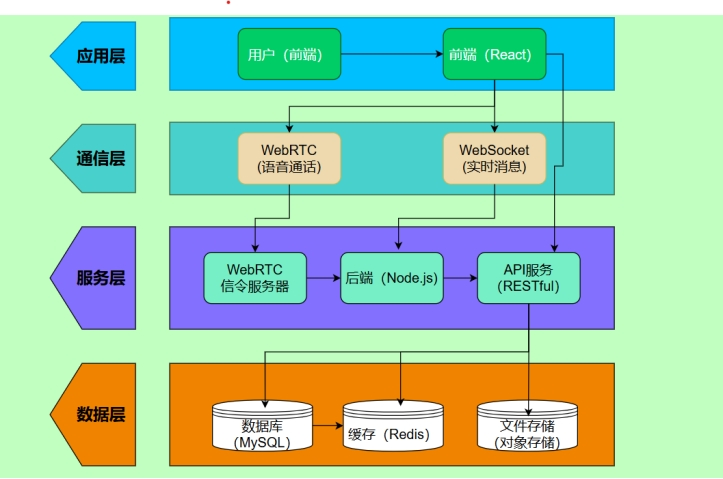
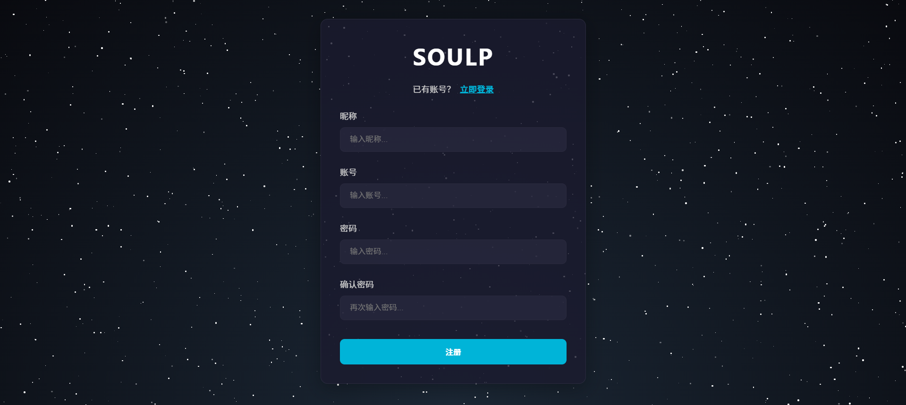
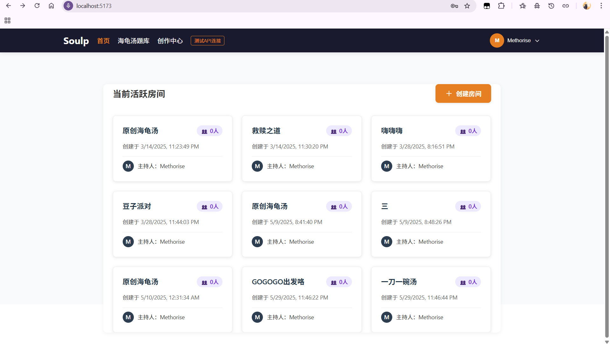
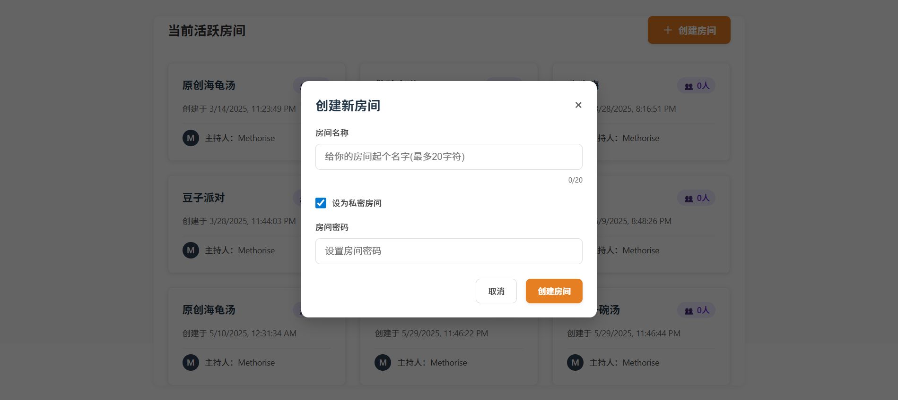
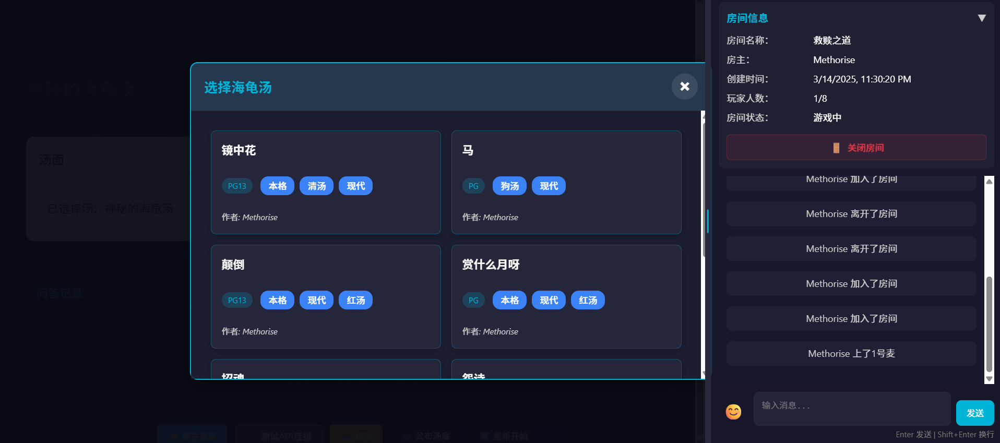
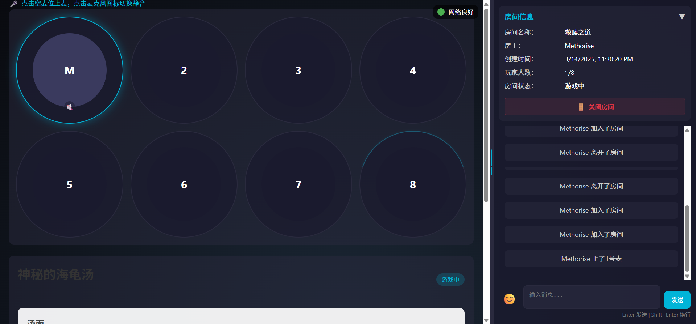
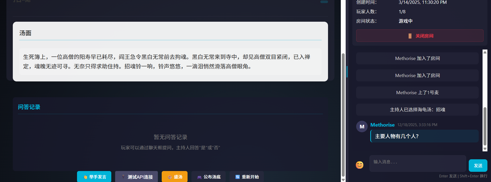

# 🐢 Soulp - 海龟汤游戏平台

一个基于 WebRTC 的在线海龟汤（情境推理游戏）游戏平台，支持实时语音聊天、多人房间管理和丰富的海龟汤题库。


## ✨ 特性

- 🎮 **海龟汤游戏** - 经典的情境推理游戏，支持多人在线对战
- 🎤 **实时语音聊天** - 基于 WebRTC 的低延迟语音通信
- 🏠 **房间系统** - 创建私密或公开房间，支持密码保护
- 📚 **题库管理** - 丰富的海龟汤题库，支持创作和分享
- 👥 **用户系统** - 注册登录、个人中心、游戏记录
- 💬 **实时聊天** - 文字聊天和系统消息通知
- 🌟 **响应式设计** - 支持桌面和移动设备

## 🚀 快速开始

### 环境要求

- Node.js >= 18.0.0
- MySQL >= 8.0
- Redis >= 6.0 (可选，用于缓存)
- 现代浏览器 (Chrome 80+, Firefox 75+, Safari 13+)

### 安装依赖

1. **克隆项目**
```bash
git clone https://github.com/your-username/soulp.git
cd soulp
```

2. **一键安装所有依赖**
```bash
# 方法1: 使用安装脚本 (Windows)
install.bat

# 方法2: 手动安装
npm install
cd soulp-client && npm install
cd ../soulp-server && npm install
```

### 环境配置

1. **配置数据库**

   在 `soulp-server` 目录下创建 `.env` 文件：
```env
# 数据库配置
DB_HOST=localhost
DB_USER=your_username
DB_PASSWORD=your_password
DB_NAME=soulp
DB_PORT=3306

# Redis 配置
REDIS_HOST=localhost
REDIS_PORT=6379
REDIS_PASSWORD=

# JWT 配置
JWT_SECRET=your_jwt_secret_key

# 服务器端口
PORT=5000
```

2. **初始化数据库**
```bash
cd soulp-server
node db/init.js
```

### 启动项目

1. **启动 Redis 服务**
```bash
# Windows
redis-server

# macOS (使用 Homebrew)
brew services start redis

# Linux
sudo systemctl start redis
# 或者
redis-server
```

2. **启动服务端**
```bash
cd soulp-server
node server.js
```
服务端将在 http://localhost:5000 启动

3. **启动客户端**
```bash
cd soulp-client
npm start
```
客户端将在 http://localhost:3000 启动

4. **一键启动** (Windows)
```bash
start.bat
```

### 访问应用

打开浏览器访问 http://localhost:3000

## 🏗️ 项目架构

本项目采用分层架构设计，自上而下分为**应用层**、**通信层**、**服务层**和**数据层**，各层职责明确，通过标准化接口实现解耦，支持高并发、实时通信及数据持久化需求。



### 架构分层

#### 1. 应用层（最上层）
- **核心组件**：
  - **用户（前端）**：最终用户通过浏览器/移动端访问系统的入口，发起语音通话或实时消息请求
  - **前端（React）**：基于React框架构建的Web应用，负责用户界面渲染、交互逻辑处理及与通信层的连接
- **技术栈**：React 19.0.0
- **数据流向**：用户操作触发前端逻辑，前端通过**通信层**的协议与后端服务交互

#### 2. 通信层（中间层）
- **核心组件**：
  - **WebRTC（语音通话）**：基于WebRTC协议实现实时语音通信，负责前后端之间的**语音数据传输**
  - **WebSocket（实时消息）**：基于WebSocket协议实现实时消息推送，负责前后端之间的**文本/状态消息传输**
- **技术栈**：WebRTC API、Socket.io
- **数据流向**：前端通过WebRTC与后端建立语音通话连接；通过WebSocket与后端建立实时消息通道

#### 3. 服务层（核心逻辑层）
- **核心组件**：
  - **WebRTC信令服务器**：处理WebRTC的**信令协商**（如SDP交换、ICE候选者传输）
  - **后端（Node.js）**：基于Node.js构建的服务器，负责**业务逻辑处理**
  - **API服务（RESTful）**：提供标准的RESTful API接口，支持数据的**增删改查**
- **技术栈**：Node.js + Express、RESTful API、JWT认证
- **数据流向**：处理业务逻辑，通过WebSocket向前端推送实时消息，通过API服务与数据层交互

#### 4. 数据层（最底层）
- **核心组件**：
  - **数据库（MySQL）**：关系型数据库，存储**结构化数据**（用户信息、聊天记录、通话日志）
  - **缓存（Redis）**：内存数据库，存储**高频访问数据**（用户在线状态、会话信息）
- **技术栈**：MySQL 8.0+、Redis 6.0+
- **数据流向**：API服务通过RESTful接口向数据层发起请求，实现数据的持久化存储

### 数据流向示例

**语音通话流程**：
1. 用户点击"发起通话" → React前端处理
2. 前端通过WebRTC发送通话请求 → WebRTC信令服务器
3. 信令服务器处理请求，协商通话参数 → Node.js后端
4. 后端通过WebRTC向对方发送通话邀请 → 目标用户前端
5. 用户同意后建立通话连接，语音数据直接通过WebRTC传输

**实时消息流程**：
1. 用户输入消息并点击"发送" → React前端
2. 前端通过WebSocket发送消息 → Node.js后端
3. 后端处理消息路由，通过WebSocket向目标用户推送 → 目标用户前端
4. 目标用户前端接收消息，显示在聊天界面

### 架构优势
- **分层解耦**：各层职责独立，便于维护和扩展
- **实时性保障**：WebRTC与WebSocket结合，支持低延迟的语音通话与实时消息
- **高可用性**：Redis缓存提升数据读取速度，MySQL保证数据持久化
- **可扩展性**：Node.js的异步非阻塞特性支持高并发，RESTful API便于第三方集成

## 📋 功能模块设计与实现

### 🔐 登录注册模块设计与实现

**具体功能实现描述**

首先对用户管理模块的实现进行说明。登录注册模块是本平台的基础模块之一，承担着用户注册、登录、身份验证与信息维护等核心任务。为保障平台安全性与用户隐私，该模块在设计上采用了密码加密存储、令牌验证、权限控制等一系列措施。用户注册时系统会对密码进行哈希处理后存入数据库，登录时则通过比对密码哈希值进行身份确认，并生成JWT令牌以维持用户登录状态。在个人资料管理方面，用户可修改昵称、密码等信息，系统会对敏感数据的修改进行权限校验和数据校验，以防止越权访问与非法输入。前端界面基于React实现，后端采用Node.js配合Express框架，并通过MySQL数据库持久化用户信息。

#### 技术实现
- **前端技术栈**：React 19.0.0 + Ant Design 5.24.3 + Axios
- **后端技术栈**：Node.js + Express + JWT + bcryptjs
- **数据库**：MySQL 8.0+ 存储用户信息
- **安全机制**：
  - 密码哈希加密（bcryptjs）
  - JWT令牌验证
  - 输入数据校验与过滤
  - 权限控制中间件

#### 主要功能
- ✅ 用户注册（用户名、密码、邮箱验证）
- ✅ 用户登录（密码验证、JWT令牌生成）
- ✅ 密码找回（邮箱验证）
- ✅ 个人资料管理（昵称、头像、密码修改）
- ✅ 登录状态保持（JWT令牌自动续期）

#### 📸 界面截图

- 登录页面

	

- 注册页面

	

- 个人资料页面

	

---

### 🏠 房间管理功能模块设计与实现

**具体功能实现描述：**

对房间管理模块的实现进行说明。房间管理模块是用户参与互动游戏的前提条件，它提供了创建房间、浏览房间、加入与退出房间、以及房主对房间设置的管理功能。用户可以设定房间为公开或私密形式，私密房间需要设定密码以限制访问权限。房间创建完成后，房主将自动加入房间并获得管理权限。房间列表功能支持分页加载与筛选展示，以提升浏览效率。模块实现过程中，前端通过调用RESTful API实现房间的创建与加入操作，后端在接收到请求后进行参数校验和业务逻辑处理，同时将房间信息存入MySQL数据库，并维护房间与用户之间的关联表以管理房间成员关系。

#### 技术实现
- **前端技术栈**：React + React Router + Ant Design
- **后端技术栈**：Node.js + Express + Socket.io
- **实时通信**：WebSocket实现房间状态实时更新
- **数据库设计**：
  - `rooms` 表：存储房间基本信息
  - `room_members` 表：管理房间成员关系
  - `room_settings` 表：存储房间配置信息

#### 主要功能
- ✅ 创建房间（房间名称、密码保护、最大人数限制）
- ✅ 房间列表（分页显示、筛选功能、实时状态）
- ✅ 加入房间（密码验证、人数限制检查）
- ✅ 房间管理（房主权限、成员管理、设置修改）
- ✅ 退出房间（正常退出、强制踢出）

#### 📸 界面截图

- 房间列表页面

	

- 创建房间对话框

	

---

### 🐢 海龟汤游戏模块设计与实现

**具体功能实现描述**

对海龟汤游戏模块的实现进行说明。海龟汤模块是平台的核心游戏模块，主要功能包括题目创建、游戏参与、提问与回答、游戏结束揭晓等。创建者在房间内发起题目，其他成员通过提问探索故事真相，创建者以"是/否/无关"等方式回应。系统记录每一次提问与回答的互动数据，用于游戏回顾与结果分析。为确保游戏公平性，模块还设计了状态控制机制，如题目是否公开、游戏是否结束等标志字段。前端提供了简洁直观的交互界面，后端对每一步操作进行权限判断并更新数据库状态，从而实现稳定的多人协作游戏体验。

#### 技术实现
- **前端技术栈**：React + Socket.io Client + Ant Design
- **后端技术栈**：Node.js + Socket.io + Express
- **实时交互**：WebSocket实现游戏状态实时同步
- **数据库设计**：
  - `soup_questions` 表：海龟汤题目库
  - `game_sessions` 表：游戏会话记录
  - `game_qa` 表：提问与回答记录
  - `game_history` 表：游戏历史统计

#### 主要功能
- ✅ 题目管理（创建题目、题目分类、难度分级）
- ✅ 游戏流程（开始游戏、提问环节、答案揭晓）
- ✅ 互动机制（提问、回答、提示功能）
- ✅ 游戏记录（历史回顾、成绩统计、排行榜）
- ✅ 题目分享（用户创作、社区分享）

#### 游戏流程
1. **准备阶段**：房主选择题目，设置游戏参数
2. **游戏阶段**：玩家轮流提问，房主回答是/否/无关
3. **互动阶段**：讨论分析，推理故事真相
4. **结束阶段**：揭晓答案，游戏总结

#### 📸 界面截图位置

- 题目选择界面

	

- 游戏进行界面

	

- 提问回答界面截图

	

---

### 💬 实时通信模块设计与实现

**具体功能实现描述**

对实时通信模块的实现进行说明。实时通信模块为用户之间的互动提供了基础支撑，包括文字聊天与语音通话两部分。其中文字聊天基于Socket.io实现实时消息广播，每条消息在后端落库后向房间内所有成员同步更新。语音通话则通过WebRTC协议实现，用户可自愿选择加入语音互动。该模块支持多人同时通话，具备静音、下麦、发起通话等功能。系统还设有语音连接状态检测机制以提升通信稳定性。模块开发中，前端通过获取本地音频流并接入WebRTC连接通道，后端则负责Socket信令的转发与连接维护。

#### 技术实现
- **文字聊天**：
  - **前端**：Socket.io Client + 消息队列管理
  - **后端**：Socket.io + Redis消息缓存
  - **存储**：MySQL消息历史 + Redis实时状态

- **语音通话**：
  - **前端**：WebRTC API + 音频流管理
  - **后端**：WebRTC信令服务器 + NAT穿透
  - **协议**：SRTP加密传输 + ICE连接建立

#### 主要功能
- ✅ 文字聊天（实时消息、消息历史、表情符号）
- ✅ 语音通话（多人通话、音质调节、连接状态）
- ✅ 系统通知（加入房间、游戏状态、系统公告）
- ✅ 消息管理（消息过滤、敏感词检测、消息撤回）

#### 通信协议
- **WebSocket协议**：`ws://localhost:5000/socket.io`
- **WebRTC协议**：P2P连接 + STUN/TURN服务器
- **数据格式**：JSON统一数据格式
- **安全机制**：WSS加密传输 + JWT身份验证

#### 📸 界面截图位置

- 语音通话界面
- 
- 📁 项目结构

```
soulp/
├── soulp-client/          # React 前端应用
│   ├── public/           # 静态资源
│   ├── src/
│   │   ├── components/   # 公共组件
│   │   ├── pages/        # 页面组件
│   │   ├── services/     # API 服务
│   │   ├── hooks/        # 自定义 Hooks
│   │   └── App.jsx       # 主应用组件
│   └── package.json
├── soulp-server/         # Node.js 后端应用
│   ├── routes/           # API 路由
│   ├── middleware/       # 中间件
│   ├── db/              # 数据库相关
│   ├── server.js        # 服务器入口
│   └── package.json
├── public/              # 公共文件
├── install.bat          # 一键安装脚本
├── start.bat           # 一键启动脚本
├── requirements.txt    # 依赖清单
└── README.md
```

## 🎮 游戏玩法

1. **创建/加入房间**
   - 注册/登录账号
   - 创建新房间或加入现有房间
   - 房主拥有特殊权限（选择题目、公布答案等）

2. **海龟汤游戏**
   - 房主选择一个海龟汤题目
   - 玩家通过提问来获取线索
   - 房主只能回答"是"、"否"或"不重要"
   - 猜出完整故事背景即为胜利

3. **语音聊天**
   - 点击麦位加入语音聊天
   - 支持麦克风静音/取消静音
   - 实时显示说话状态

## 🔧 开发指南

### 技术栈

**前端：**
- React 19.0.0
- React Router 7.3.0
- Ant Design 5.24.3
- Tailwind CSS 3.4.17
- WebRTC API
- Socket.io Client

**后端：**
- Node.js + Express
- Socket.io
- MySQL
- JWT 认证
- Redis (可选)

### API 文档

#### 用户相关
- `POST /api/register` - 用户注册
- `POST /api/login` - 用户登录
- `GET /api/users/profile` - 获取用户信息

#### 房间相关
- `GET /api/rooms` - 获取房间列表
- `POST /api/rooms` - 创建房间
- `GET /api/rooms/:id` - 获取房间详情

#### 海龟汤相关
- `GET /api/soup` - 获取题库列表
- `GET /api/soup/:id` - 获取题目详情
- `POST /api/soup` - 创建新题目

### 开发命令

```bash
# 安装依赖
npm install

# 启动开发服务器
npm start

# 构建生产版本
npm run build

# 运行测试
npm test
```

## 🌐 部署

### 前端部署

1. 构建静态文件：
```bash
cd soulp-client
npm run build
```

2. 将 `build` 目录部署到静态服务器

### 后端部署

1. 安装 PM2：
```bash
npm install -g pm2
```

2. 启动应用：
```bash
cd soulp-server
pm2 start server.js --name "soulp-server"
```

3. 配置 Nginx 反向代理：
```nginx
server {
    listen 80;
    server_name your-domain.com;

    location / {
        root /path/to/build;
        try_files $uri $uri/ /index.html;
    }

    location /api {
        proxy_pass http://localhost:5000;
        proxy_http_version 1.1;
        proxy_set_header Upgrade $http_upgrade;
        proxy_set_header Connection 'upgrade';
        proxy_set_header Host $host;
        proxy_cache_bypass $http_upgrade;
    }
}
```

## 🤝 贡献

欢迎提交 Pull Request 和 Issue！

1. Fork 项目
2. 创建功能分支 (`git checkout -b feature/AmazingFeature`)
3. 提交更改 (`git commit -m 'Add some AmazingFeature'`)
4. 推送到分支 (`git push origin feature/AmazingFeature`)
5. 打开 Pull Request

## 📝 更新日志

### v1.0.0 (2025-12-18)
- ✨ 初始版本发布
- 🎮 基础海龟汤游戏功能
- 🎤 WebRTC 实时语音聊天
- 👥 用户系统和房间管理
- 📚 海龟汤题库功能

## ❓ 常见问题

### Q: WebRTC 语音功能无法使用？
A: 确保浏览器已授予麦克风权限，并使用 HTTPS 访问（localhost 除外）

### Q: 房间连接失败？
A: 检查后端服务是否正常启动，确认防火墙设置

### Q: 数据库连接错误？
A: 检查 `.env` 文件中的数据库配置是否正确

## 📄 许可证

本项目采用 MIT 许可证 - 查看 [LICENSE](LICENSE) 文件了解详情

## 👥 作者

- **开发者** - [Seemerry](https://github.com/Seemerry)

## 🙏 致谢

- [React](https://reactjs.org/) - 前端框架
- [Express](https://expressjs.com/) - 后端框架
- [Socket.io](https://socket.io/) - 实时通信
- [WebRTC](https://webrtc.org/) - 音视频通信
- [Ant Design](https://ant.design/) - UI 组件库

---

⭐ 如果这个项目对你有帮助，请给个 Star！